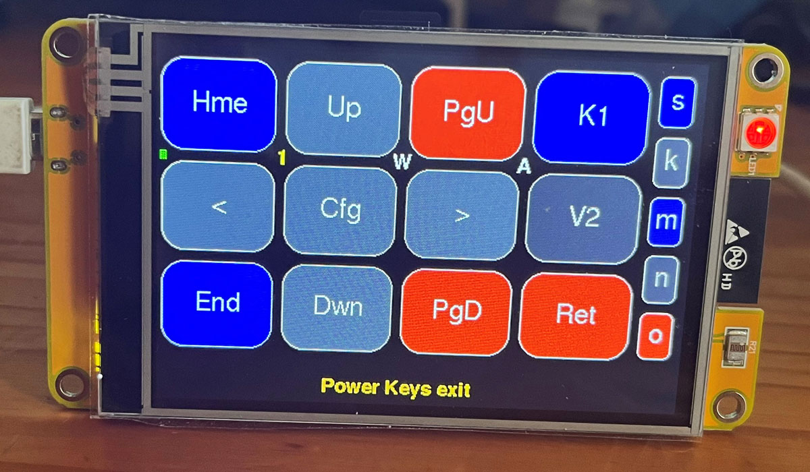
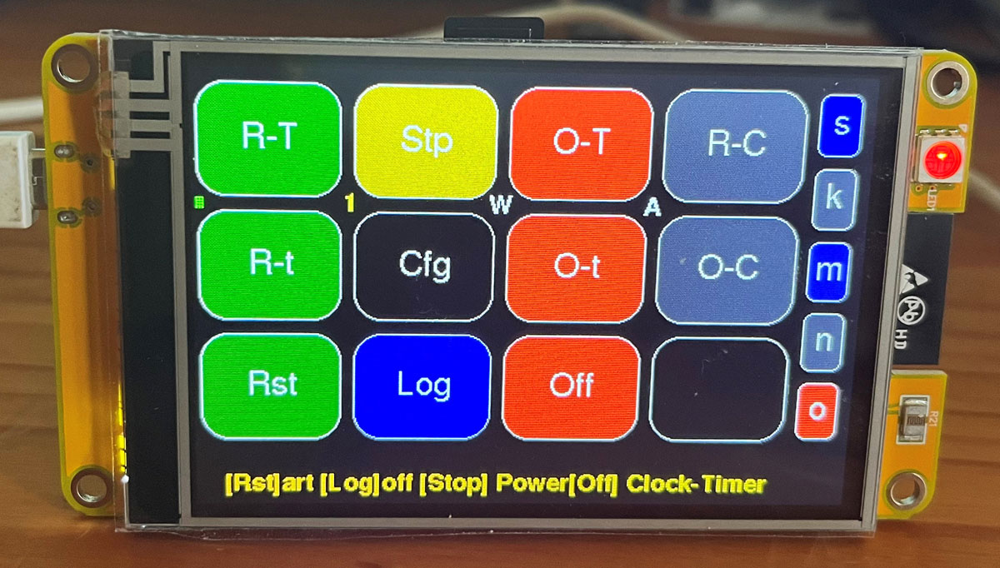
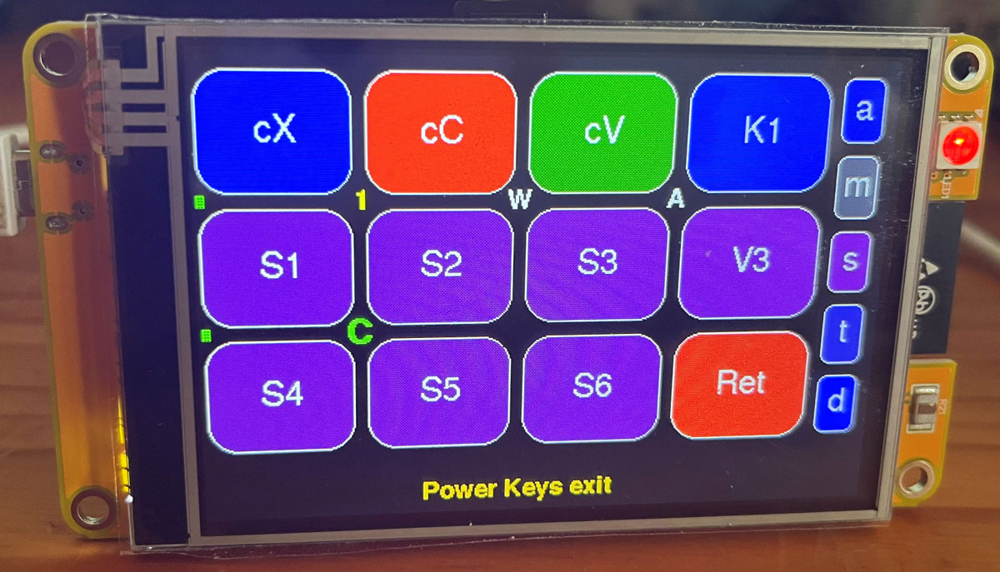
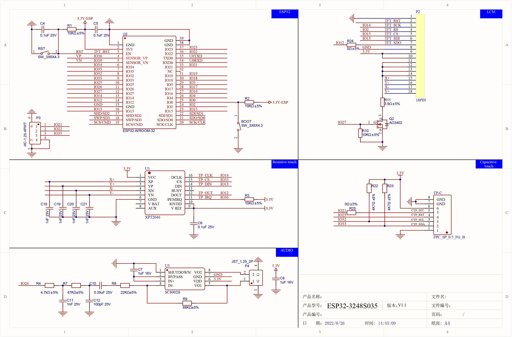
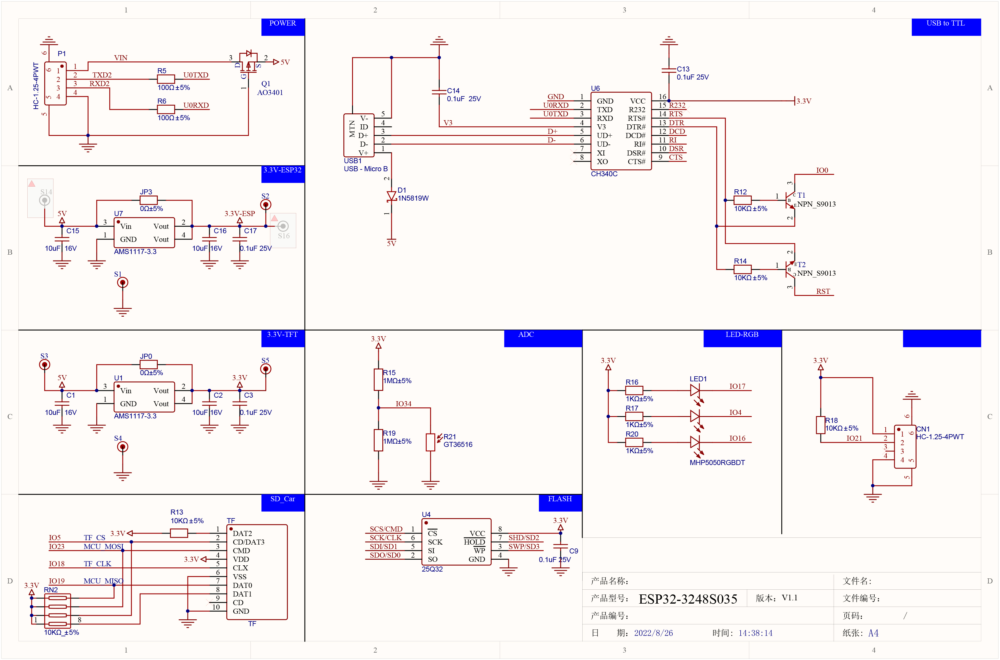

# ESP32 CYB LCD Bluetooth Touch Macropad

 
 
 

An **ESP32-WROOM-32** is used as a **Bluetooth Touch LCD Macropad** with direct access to 513 single and 96 link-list macros - namely 3 independent sets (note 1), of 72 user-programmable macros, selectable from 3 sets of three banks of 24 macros, as well as another three sets of 99 programmable macro-files, each of which can be further linked through a plaintext list of 3-letter macro-filenames. In addition 456 (19 sets of 24 files), text files can be accessed directly from an SDCard using the same macro-keys. There are more than 50 different pages and layouts for actions such as Media-keys (Volume Mute Play-Stop Next-Previous Bass-Treble), inserting special characters and mathematics symbols, a Restart-Shutdown Timer Configuration, Timer-executed repeat-and-oneshot macros, a Macro Composition, Manipulation, File, and Linking editor, an enhanced 3 page Numberpad, and easy access for showing PC sensor data, Music Player information, or manipulating many other specialized data sources from a PC running GNU/Linux, and/or Windows. Note 1: Macro definitions (A01-A99, S1-S24, T1-T24, M1-M24) can be stored on the flash file-system as lowercase filenames (i.e. s01-s24 etc), or uppercase filenames (S01-S24), or on the SDCard as one set only of lower or uppercase files but here file s01 = file S01. Macros: 3x99 A-files + 3x3x24 MST-files = 513. Linked-List Macros: 3x24 M,S,T,01Link-M,S,T,24Link + K01Link-K24Link = 96 linked-lists. Because the linked-list macros can contain any 3-character filename, the number of stored macros, especially on the SDCard, is a huge number = 36^3 = 46,656 macro-files, and this is without upper-lower-case combinations on flash-storage which is then (26+26+10)^3 = 62^3 = 238,328 macros. Note 2: The linklist can be extended to load other linklist files, through LxyXnn where Xnn is the name of the next XnnLink file to be loaded and executed according to its content, and Lxy indicates various SDCard/Flash options for where the next linklist is stored, and how any switch between Flash memory and SDCard storage, should be handled.

A repeat = 20 rnn and Rnn with r = repeat 1-99 and R - repeat 100 to 9900, and three delays = 0.5 and 3 seconds, with dnn, ddn, Dnn, DDn with d 0.1-0.9, and 1-99 seconds, D 1-99 minutes, and DDn 1-9 hours, was used in the macrolink string **a50a51dd5a53d03r20a52d03U02** for the macro animation as shown in the right-hand picture above. Refer to the [**manual**](Manual.md) and the Extras - DuckyPad section, for more details. 

Eight keys - normally the [Cut][Copy]Paste[Delete][Return][cX][cC][cV] keys - can be assigned from 75 functions in Layouts 1, 3 and 4 - the functions are: 1 Delete 2 Backspace 3 Tab  4 AltTab 5 Insert 6 Esc 7 PrtScr 8 AltPrtScr 9 Return 10 Snipping 11 OnScrKeyBrd 12 NumLock 13 CapsLock 14 ScrollLock 15 Cut 16 Copy 17 Paste 18 TaskMan 19 Run 20 GuiX 21 Copilot 22-24 Tskbar1-6 and 28-51 K1-K24 52-75 F1-F24. The 24 K keys use the plaintext linking method as explained above or refer to the RP2040 Pico touchpad Extras - DuckyPad section, or the manual, for examples. 

Controlling the user interface appearance and functions are done using an extensive set of starcodes which can be entered on the TouchLCD or sent via a PC serial port or a Powershell command to the Touchpad. For example sending <\*x9\*0102030405060719> will set all 8 special keys - normally the Cut-Copy-Paste-Delete-Return keys, to new actions and labels - the 8 keys will then be Del Bks Tab aTb Ins Esc and [Del] = PrS and [Ret] = Run. Using a Powershell get-process, one can then set these keys according to which PC application is open. These \* commands can also be in a macrolink file.
This means it is possible with a single macropad keypress to open for example photoshop on a PC, and at the same time re-configure the macropad keys for photoshop-specific functions. See Example 8 in the manual for more detail.

The LCD display used are avialable here: [**Communica ESP32 CYB ST7796 3.5inch 320x480**](https://www.communica.co.za/products/bdd-esp32-lvgl-wifi-bt-3-5in-lcd) and it includes an SDCard holder. Schematics for this LCD are in the images folder.

 
 

The previousl RPi Pico RP20240 code was modified for the ESP32, and compiled with ESP32Arduino 2.0.17 and TFTeSPI 2.5.43 and ESP32 BLE Keyboard library: 
https://github.com/Cemu0/ESP32-BLE-Keyboard/tree/addSpecialKeySync which includes CapsNumScroll lock indicators  

The SDCard slot can be used for saving and reading files both text and Macro definition files. When textfiles are used the 21 sets of 24 keys each send the SDCard files as keyboard characters to the PC - the size of the files/strings are only limited by the SDCard size. Change between 21 SDCard file-sets of 24 x 3 files each, with \*sd\*n. Refer to the [**manual**](Manual.md) for further instructions.

